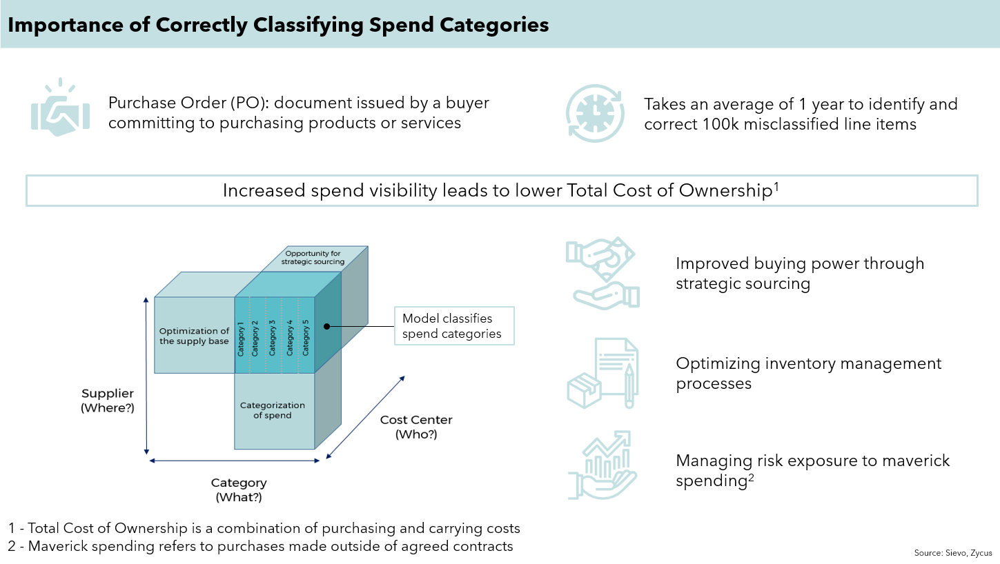
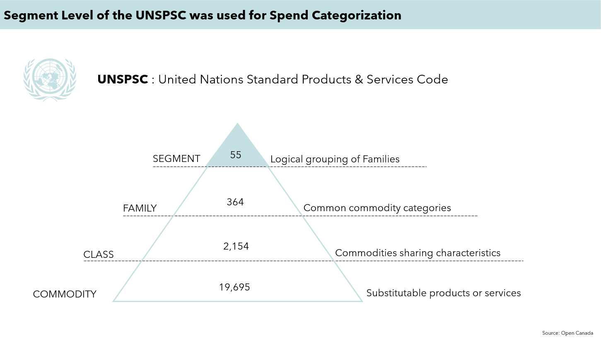
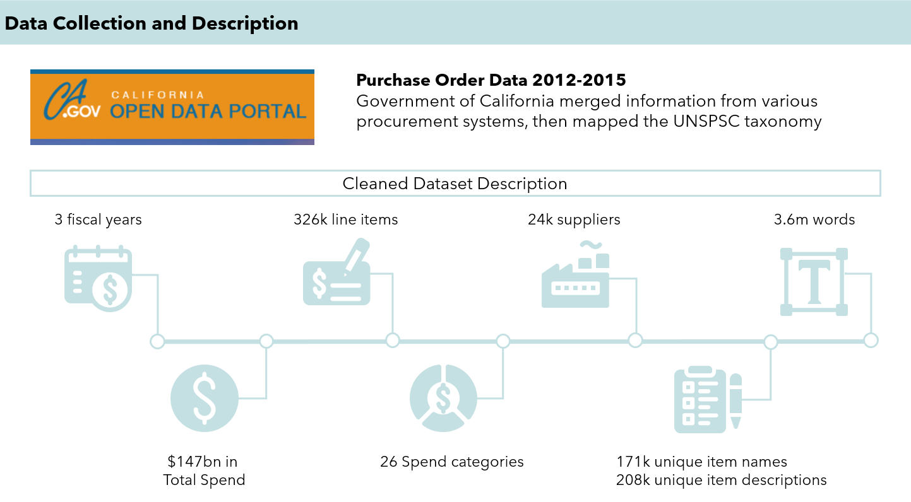
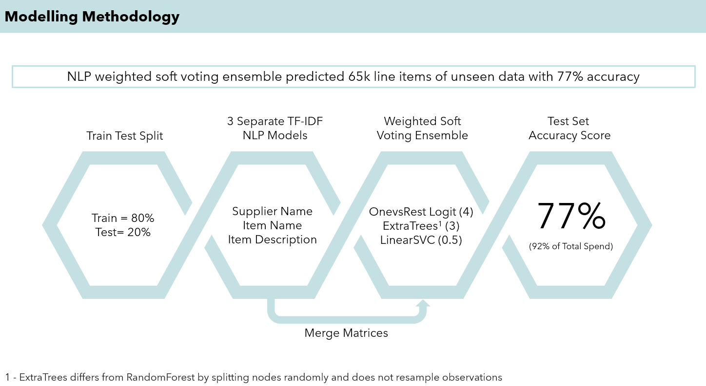
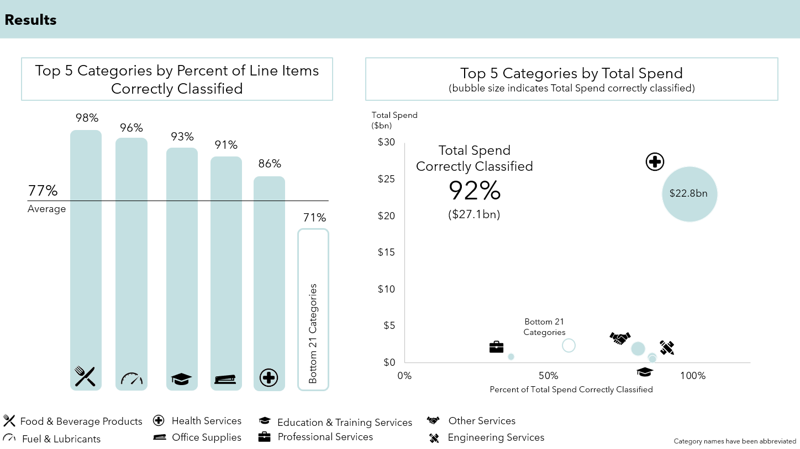
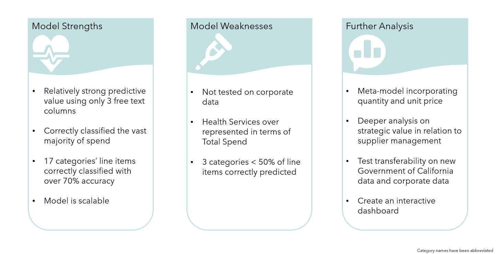

## Putting the Cure into Strategic Procurement

Natural Language Processing soft weighted voting ensemble multi-class classifier to predict spend categories using [Goverment of California's 2012-2015 Purchase Orders ](https://data.ca.gov/dataset/purchase-order-data/resource/bb82edc5-9c78-44e2-8947-68ece26197c5) 

### Table of contents
* Final Report  
* Final Presentation Deck  
* EDA Jupyter Notebook   
* Modelling Jupyter Notebook  
* Results Jupyter Notebook  
* [Video Presentation](http://www.youtube.com/watch?v=XC6w5jzgaEU&t=2s)

### Motivation
As a former management consultant, a client asked for a detailed spend analysis of their purchase orders. This allowed me to experience first hand how labour intensive and frustrating that can be when done manually in excel. However, this experience also reinforced the business importance of timely and accurate spend analysis to identify cost saving opportunities and ultimately facilitate strategic procurement decision making and sourcing. 

### Objective
To achieve the highest accuracy score when predicting spend categories. The Segment level of the United Nations Standard Products & Sevices Code (UNSPSC) was used as the target.

### Cleaning process and feature engineering 
Delete rows with:  
Supplier Name as 'Unknown'  
Total Price <= $0  
Item Name as blank of 'confidential'  
Segment as blank  
Bottom 20% of categories by line items placed into either Other Services or Other Goods  

### Modelling brief overview
The cleaned dataset was split data into 80% for training and 20% for test.
3 separate TF-IDF NLP models on Supplier Name, Item Name and Item Description where created.  
After merging the matrices, the new sparse matrix was fitted to a weighted soft voting ensemble consisting of OnevsRest Logistic(4) Regression, ExtraTrees(3) and LinearSVC(0.5) models.

### Results
This modelling approach resulted in a 77% accuracy test score, which correctly classified 92% of total spend.

### Conclusion
The model exceeded my expectations on accuracy for 26 categories with 77%. However, it’s applications to corporate data may be limited as a result of differences between the public sector and corperate spending focuses. Further analysis include exploring a meta-model incorporating quantity and price.

